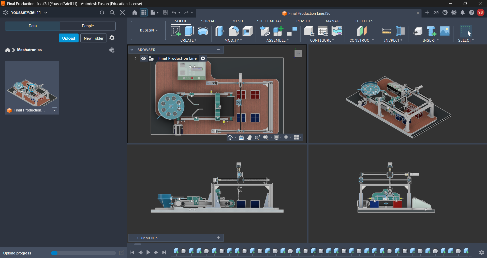
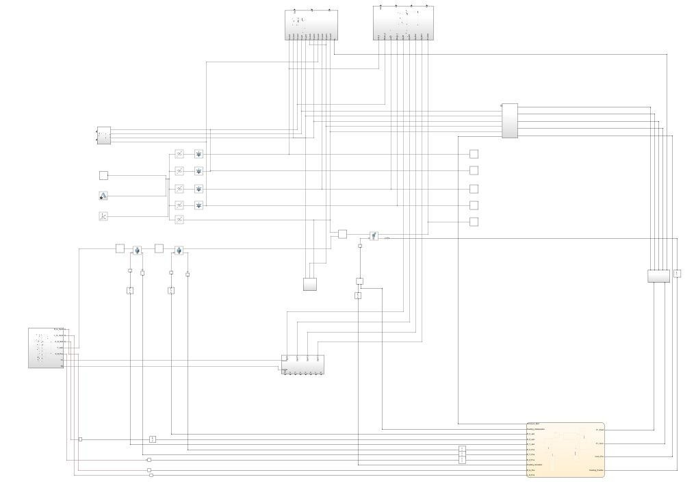
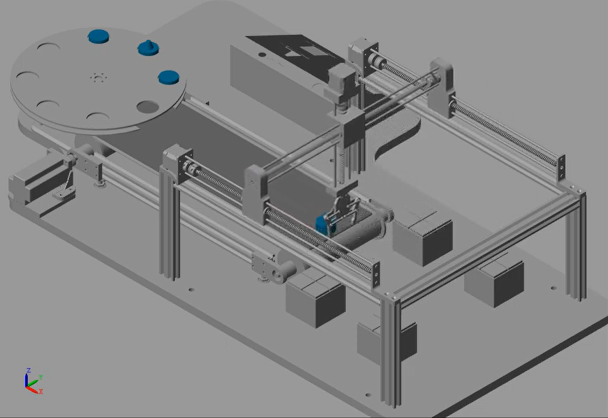

# Cooling and Sorting Automated Chocolate Bars Production Line 🍫🤖

## Project Overview
This repository contains the mechanical design, electrical schematics, mathematical models, and simulation files for an automated mechatronic production line. The system is engineered to seamlessly convey, cool, weigh, and sort chocolate bars in a high-throughput food processing environment.

## Key Features
* **Closed-Loop Thermal Management:** Dynamic forced-air cooling modulated by a PID controller responding to real-time non-contact IR temperature feedback ($20^\circ$C target).
* **Adaptive Conveyor Speed:** Variable speed regulation (nominal $0.1 \text{ m/s}$) to ensure sufficient cooling residence time.
* **Automated Sorting Mechanism:** A 3-axis Cartesian robotic arm and pneumatic diversion system for high-speed rejection of out-of-spec products (overheated, under-cooled, or improper weight).
* **Dual-Controller Architecture:** Distributed computing utilizing ESP-based microcontrollers for parallel processing of motor control (PWM) and sensor arrays (HX711 Load Cell, MLX90614 IR).

## Repository Contents
* `/1_CAD`: 3D assembly and part files for the conveyor, rotary feeder, and Cartesian robotic sorter.

  

* `/2_Simulation`: MATLAB Simscape physical network models and Simulink block diagrams for the PID control and thermal dynamics.

  
  

* `/3_Documentation`: The final compiled LaTeX technical report and force analysis derivations.

## Technologies Used
* **Simulation & Control:** MATLAB, Simulink, Simscape
* **Computing:** ESP32/Arduino, C++
* **CAD Design:** Autodesk Fusion 360

## Demonstration & Files

* 🎥 **YouTube Video:** [CAD Design: Automated Cooling and Sorting Chocolate Production Line](https://youtu.be/Yx4FxSzs9Yo)
* 📊 **YouTube Video:** [MATLAB Simulation: Automated Cooling and Sorting Chocolate Production Line](https://youtu.be/9laI-daexsU)
* 🛠️ **Interactive Model:** [View the 3D CAD Assembly on Autodesk Fusion 360](https://a360.co/4fo8kH5)